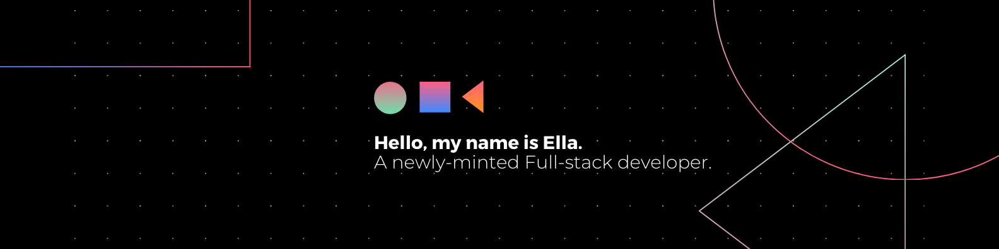

# 💫 About Me:
Hey there 👋, I'm Ella, a Web Development student at NAIT with dreams as big as the digital frontier itself. 
  
🔭 I'm currently working on my side project "Notion Clone" 
🌱 I'm studying React and TypeScript 
🙌 I'm looking to collaborate on open source projects 
🎯 Hobbies: I love to play Indie game, Simulation Game. 
⚡ Fun fact: My first degree was a whole world away from tech, but here I am, diving headfirst into the world of code!

## 🌐 Socials:
  

## 💻 Tech Stack:
                  

### 📊 My stats

### ✍️ Random Dev Quote

---

<!-- Proudly created with GPRM ( https://gprm.itsvg.in ) -->